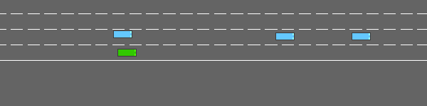
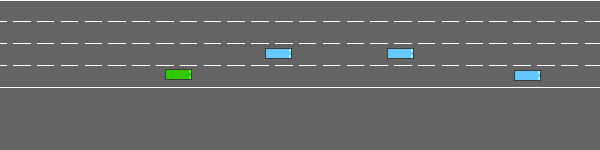
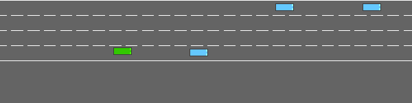
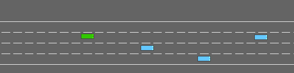
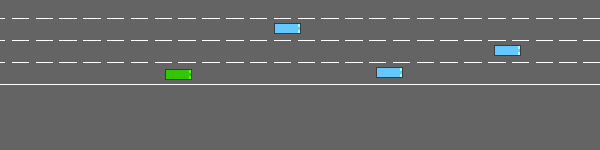
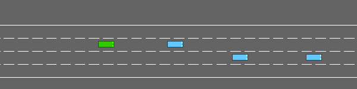
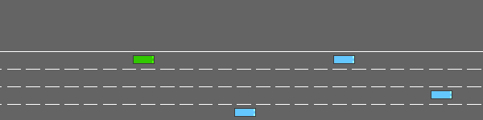

# BAAS: Benchmarking Adversarial Agent Strategies

A reproducible benchmarking framework for adversarial scenario generation in autonomous driving validation. Five adversarial paradigms are compared under identical conditions against a frozen ego policy in a highway driving environment.

**Paper:** C. Frischknecht-Gruber, M. Reif, A. Fischer. *BAAS: Benchmarking Adversarial Agent Strategies. A Comparative Study of Gradient-based, Reinforcement, and Evolutionary Paradigms for Safety-Critical Scenario Generation.* Proc. 36th European Safety and Reliability Conference (ESREL 2026)

---

## Methods

| Method | Paradigm | Description |
|---|---|---|
| Parameter Sweep | Non-learning baseline | Deterministic grid search over initial adversary positions and velocities |
| KING-light | Gradient-based | Differentiable bicycle proxy that optimises a continuous action sequence via gradient descent |
| PPO Adversary | Reinforcement learning | Single adversary trained with PPO against the frozen ego |
| MAP-Elites | Quality-Diversity | Open-loop action sequences evolved to fill a behavioural descriptor archive |
| QD-RL | QD + Reinforcement learning | MAP-Elites archive of PPO policies, each trained with different reward shaping |

---

## Results

Results below are from extended experiment runs (May–June 2026), superseding the published paper values. See the **Corrections** section for details on numerical differences.

### Effectiveness

| Method | p_coll | Mean TTCI_adv (steps) |
|---|---|---|
| Parameter Sweep | 0.633 | - |
| KING-light | 0.447 ± 0.058 | 120.8 ± 18.9 |
| PPO Adversary | 0.633 | 78.2 |
| MAP-Elites | 0.500 | 140.4 |
| QD-RL | 0.767 | 84.9 |

### Feasibility and Plausibility

| Method | Feasibility | Max Adv Jerk (m/s³) |
|---|---|---|
| Parameter Sweep | - | - |
| KING-light | 0.561 ± 0.051 | 43.8 ± 5.2 |
| PPO Adversary | 0.263 | 53.9 |
| MAP-Elites | 0.593 | 38.3 |
| QD-RL | 0.313 | 38.3 |

Feasibility = fraction of fixed-perturbation reruns where the ego avoids terminal failure. Higher feasibility means the scenario is challenging but solvable, which is the target property for V&V-relevant scenarios.

### Table 2: Behavioural Diversity (evaluation rollouts)

| Method | Coverage (φ) | Entropy (φ) | Diversity Score |
|---|---|---|---|
| Parameter Sweep | - | - | - |
| KING-light | 0.114 ± 0.019 | 0.461 ± 0.051 | 0.287 ± 0.035 |
| PPO Adversary | 0.110 | 0.470 | 0.290 |
| MAP-Elites | 0.090 | 0.423 | 0.257 |
| QD-RL | 0.180 | 0.599 | 0.390 |

Computed via `phi_coverage_entropy()` over the φ-outcomes of the 30 shared evaluation rollouts (k=30, base_seed=0, env_seed_mode=jitter), using each method's single best-objective artefact (best-elite policy/sequence for MAP-Elites/QD-RL, single trained policy for KING-light/PPO Adversary). KING-light values are mean ± std across optimisation seeds 0-4; all other methods are single runs.

### Table 3: Archive-level Diversity (full archive)

| Method | Archive Cells | Coverage (φ) | Entropy (φ) | Diversity Score |
|---|---|---|---|---|
| MAP-Elites | 100 | 0.970 | 0.991 | 0.980 |
| QD-RL | 55 | 0.530 | 0.859 | 0.695 |

Computed by applying `phi_coverage_entropy()` to the denormalised behavioural measures of every occupied cell in each method's own archive (10×10 grid, same `PhiGridConfig` as Table 2), rather than just the single best-objective elite. Only MAP-Elites and QD-RL maintain an archive; the other methods are not shown here.

> **Note on Table 3 discretisation**: "Archive Cells" counts occupied cells in each method's own 10×10 `ribs` archive (MAP-Elites: 100/100, QD-RL: 55/100). "Coverage (φ)" instead re-bins each cell's denormalised (dist, TTCI) measures through `bin_phi()`, the same φ-grid used in Table 2, and counts *unique* occupied φ-bins: 97/100 for MAP-Elites and 53/100 for QD-RL. The small drops, from 100 to 97 and from 55 to 53, occur because `bin_phi`'s TTCI binning (`ti_frac = (ttci-1)/(H-1)`) uses slightly different bin edges than `ribs`' own grid index, so a handful of distinct archive cells land in the same φ-bin. This is a discretisation artefact of comparing two binning schemes, not a data-quality issue.

---

> **Note on Results (Update to Published Paper)**
> The extended runs (May to June 2026) supersede the values in the ESREL 2026 paper. Two systematic differences exist. First, jerk is now computed from kinematic replay traces at `dt = 0.5 s`, giving physically coherent values (16 to 54 m/s³). The paper's values (up to 1676 m/s³) were from an earlier implementation and are physically implausible. Second, the QD-RL results above are from a completed run under the revised configuration (10×10 archive, n\_iters=40, burst\_steps=25 000, n\_envs=1, ent\_coef=0.02). The paper's QD-RL feasibility of 0.767 was from a run that terminated early under a different configuration (25×25 archive, n\_iters=120 target); the completed run gives a feasibility of 0.313. All five method results above are from complete runs.

> **Note on Feasibility Across Method Types**
> Feasibility is estimated by replaying the same adversary 10 times with varied ego environment seeds and counting the fraction of reruns in which the ego survives. For active adversary methods (KING-light, PPO, MAP-Elites, QD-RL) the adversary controller is held fixed across reruns. For the parameter sweep, the background IDM/MOBIL vehicle is repositioned to the worst-case initial conditions found during the sweep. Feasibility there reflects how reliably that initial configuration leads to a critical outcome, not the robustness of a trained policy. The two feasibility values are comparable in direction (higher means harder but solvable) but differ structurally: parameter sweep feasibility characterises a static perturbation, whereas active-method feasibility characterises a trained adversarial behaviour.

> **Note on Configuration Provenance**
> The five methods were evaluated under three distinct `config_sha1` values: parameter_sweep and KING-light used `35e61bb0...`, MAP-Elites and PPO Adversary used `b57ef95c...`, and QD-RL used `1bf0f284...`. In every pairwise comparison, the diffs are confined to the `qdrl:` section of `configs/benchmark_v1.yaml` plus a cosmetic header-comment change ("MADS" → "BAAS"). The `env`, `rollouts`, `perturbation`, `incident`, `feasibility`, and `diversity` sections, which determine every metric in the tables above, are byte-identical across all three configs. The five methods are therefore directly cross-comparable.

---

## Example Scenarios

### Parameter Sweep



*Degenerate difficulty — scenario `parameter_sweep_s0_018`*

### KING-light



*Hardcore difficulty — scenario `king_light_s0_000`*



*Hard difficulty — scenario `king_light_s0_010`*

### PPO Adversary


*Hardcore difficulty — scenario `ppo_adversary_s0_000`*



*Hardcore difficulty — scenario `ppo_adversary_s0_001`*



*Hard difficulty — scenario `ppo_adversary_s0_002`*

### MAP-Elites



*Hard difficulty — scenario `map_elites_s0_024`*

### QD-RL

QD-RL adversaries are optimised to close from far behind/ahead; in these
scenarios the adversary approaches from off-screen and the collision occurs at
the moment it enters the camera frame, so it appears red (post-crash) on entry
rather than yellow (pre-crash).


*Hardcore difficulty — scenario `qdrl_s0_001`*



*Hard difficulty — scenario `qdrl_s0_014`*


*Hard difficulty — scenario `qdrl_s0_024`*

---

## Dataset Release

The scenario catalogue (`runs/catalogue.json`) records every evaluated rollout across all methods. It is a flat JSON array, one object per rollout.

### Dataset Availability

The scenario catalogue (`runs/catalogue.json`) is included in this repository. The full artefacts needed to replay scenarios (policy checkpoints, MAP-Elites/QD-RL archives, and the frozen ego policy) are available on request from xfig@zhaw.ch.

### Catalogue schema

| Field | Type | Description |
|---|---|---|
| `scenario_id` | str | Unique identifier: `{method}_s{opt_seed}_{rollout_index:03d}` |
| `method` | str | `parameter_sweep`, `king_light`, `ppo_adversary`, `map_elites`, `qdrl` |
| `opt_seed` | int | Seed index used during optimisation (0 for single-run methods) |
| `rollout_index` | int | Index into the shared rollout spec pool |
| `env_seed` | int | Gymnasium environment seed |
| `critical_incident` | bool | Whether a critical incident was triggered |
| `ego_collision` | bool | Whether the ego vehicle collided |
| `feasibility` | float\|null | Fraction of 10 reruns in which ego survives |
| `difficulty_label` | str\|null | Tier based on feasibility (see below) |
| `phi_dist` | float\|null | Behavioural descriptor: `min_dist_ego_adv` in metres |
| `phi_ttci` | float\|null | Behavioural descriptor: TTCI_adv in steps |
| `min_dist_ego_adv` | float\|null | Minimum ego-to-adversary distance in metres |
| `ttci_adv_steps` | int\|null | Time to critical incident involving adversary (steps) |
| `max_adv_jerk` | float\|null | Maximum adversary jerk in m/s³ |
| `results_path` | str | Path to `results.json` relative to catalogue dir |
| `artefact_reference` | str | Path to adversary artefact relative to catalogue dir, or `""` |

### Difficulty labels

| Label | Feasibility range | Interpretation |
|---|---|---|
| `degenerate` | < 0.10 | Ego almost always fails regardless of adversary |
| `hardcore` | 0.10 to 0.30 | Ego rarely escapes |
| `hard` | 0.30 to 0.50 | Ego escapes less than half the time |
| `medium` | 0.50 to 0.70 | Adversary holds an edge |
| `easy` | 0.70 to 1.00 | Ego mostly survives |
| `trivial` | 1.00 | Ego always survives |

### Generating or extending the catalogue

```bash
# Add a method's run(s) to the catalogue (append-safe, skips duplicate scenario_ids):
python -m baas.data.catalogue \
    --catalogue runs/catalogue.json \
    --run-dirs runs/map_elites/run_000 \
    --artefact-name archive.json \
    --opt-seeds 0

# Multi-seed methods (e.g. KING-light seeds 0-4):
python -m baas.data.catalogue \
    --catalogue runs/catalogue.json \
    --run-dirs runs/king_light/run_king_light_seed{0,1,2,3,4} \
    --artefact-name king_light_artefact.json \
    --opt-seeds 0 1 2 3 4
```

### Replaying a scenario by ID

```python
from pathlib import Path
from baas.adapters.highway_env.adapter import HighwayEnvAdapter
from baas.core.ego_policy import DQNEgoPolicy
from baas.core.metrics import IncidentThresholds
from baas.evaluation.replay import replay_by_scenario_id

result = replay_by_scenario_id(
    scenario_id="map_elites_s0_007",
    catalogue_path=Path("runs/catalogue.json"),
    adapter=HighwayEnvAdapter(),
    ego_policy=DQNEgoPolicy("pretrained/frozen_model_dqn_cnn.zip"),
    thresholds=IncidentThresholds(...),
    output_path=Path("replay_map_elites_s0_007.gif"),
)
```

---

## Corrections to Published Paper

The extended runs revealed two systematic differences from the paper's reported values:

**Jerk values**: The paper reported Max Adv Jerk values of 1676 m/s³ (KING-light) and 961 m/s³ (MAP-Elites). The current implementation computes jerk from kinematic replay traces using `dt = 1/policy_frequency = 0.5 s`, yielding physically coherent values in the 16–54 m/s³ range. The paper's values were produced by an earlier implementation and are physically implausible for highway vehicles (comfort limit ~6 m/s³, emergency limit ~60–100 m/s³). The conceptual ordering is preserved: QD-RL still produces the lowest adversary jerk of all active methods.

**QD-RL feasibility**: The paper reported QD-RL feasibility of 0.767 (Table 4, "Feas." column, not the p_collision of 0.233 in Table 1). That run terminated early (25×25 archive, n_iters=120 target, stopped incomplete). The completed run under the revised configuration (10×10 archive, n_iters=40, burst_steps=25 000, n_envs=1, ent_coef=0.02) gives a feasibility of 0.313, substantially lower than the early-terminated estimate and now in the same range as PPO Adversary (0.263) rather than the higher-feasibility MAP-Elites/KING-light methods.

**PPO terminal reward**: The paper defines the terminal reward on ego collision. In the implementation it fires on any critical incident, including proximity-only triggers. This is deliberate and produces a slightly more aggressive adversary during training. It does not affect evaluation metrics, which use the shared neutral evaluation path.

---

## Setup

Requires Python 3.10+.

```bash
python -m venv .venv
source .venv/bin/activate
pip install -r requirements.txt
pip install -e .
```

---

## Running Experiments

All scripts are in `baas/scripts/`. Each takes `--config configs/benchmark_v1.yaml` and `--ego-policy pretrained/frozen_model_dqn_cnn.zip`.

```bash
# Parameter sweep (baseline)
python baas/scripts/run_parameter_sweep.py \
    --config configs/benchmark_v1.yaml \
    --ego-policy pretrained/frozen_model_dqn_cnn.zip \
    --output runs/parameter_sweep/run_000

# KING-light (gradient-based)
python baas/scripts/run_king_light.py \
    --config configs/benchmark_v1.yaml \
    --ego-policy pretrained/frozen_model_dqn_cnn.zip \
    --output runs/king_light/run_000

# PPO adversary (RL)
python baas/scripts/run_ppo_adversary.py \
    --config configs/benchmark_v1.yaml \
    --ego-policy pretrained/frozen_model_dqn_cnn.zip \
    --output runs/ppo_adversary/run_000

# MAP-Elites (QD)
python baas/scripts/run_map_elites.py \
    --config configs/benchmark_v1.yaml \
    --ego-policy pretrained/frozen_model_dqn_cnn.zip \
    --output runs/map_elites/run_000

# QD-RL
python baas/scripts/run_qdrl.py \
    --config configs/benchmark_v1.yaml \
    --ego-policy pretrained/frozen_model_dqn_cnn.zip \
    --output runs/qdrl/run_000

# Summarise all results
python baas/scripts/run_benchmark.py summarise runs/ --output runs/summary
```

---

## Cluster / Long-running Jobs

QD-RL is the most compute-intensive method. Recommended settings (already set in `configs/benchmark_v1.yaml`):

```
burst_steps: 25000   # training steps per candidate
n_envs: 1            # one env per worker process
archive_grid_dims: [10, 10]
n_iters: 40
ent_coef: 0.02
device: cpu          # workers are CPU-only by design
```

Each iteration's candidates are trained in parallel across CPU worker processes via
`ProcessPoolExecutor`, controlled by `--max-workers` (default: `min(n_candidates, cpu_count)`).
Archive evaluation and insertion remain sequential. The method is CPU-only by design. There
is no GPU path.

```
python baas/scripts/run_qdrl.py \
    --config configs/benchmark_v1.yaml \
    --ego-policy pretrained/frozen_model_dqn_cnn.zip \
    --output runs/qdrl/run_001 \
    --max-workers 8
```

Expected wall time: ~16 hours on a CPU node with 16 workers.

On a CPU-only cluster, install the CPU build of torch (use the PyTorch CPU index-url). `box2d-py`
can be omitted, as it is only needed for the racetrack/parking envs, not the highway scenario used here.

---

## Citation

```bibtex
@inproceedings{frischknecht2026baas,
  title     = {{BAAS}: Benchmarking Adversarial Agent Strategies ---
               A Comparative Study of Gradient-based, Reinforcement,
               and Evolutionary Paradigms for Safety-Critical Scenario Generation},
  author    = {Frischknecht-Gruber, C. M. and Reif, Monika and Fischer, Andreas},
  booktitle = {Proceedings of the 36th European Safety and Reliability Conference (ESREL 2026)},
  year      = {2026},
  publisher = {Research Publishing}
}
```
